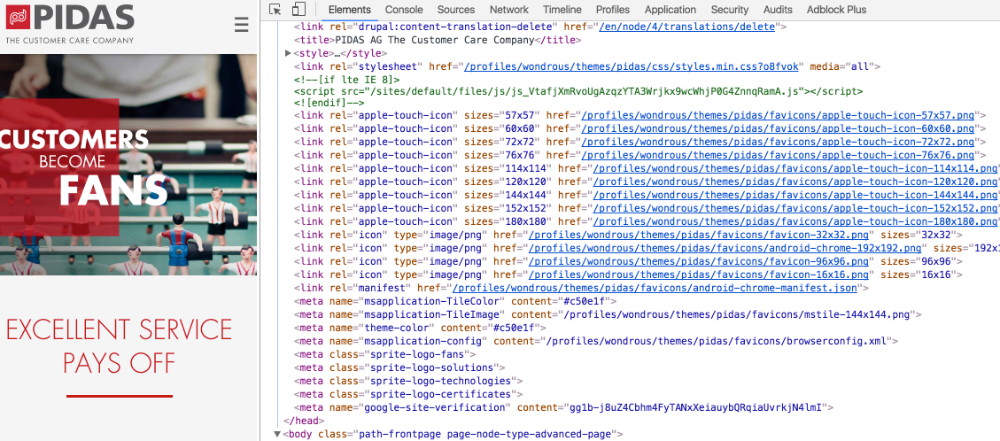
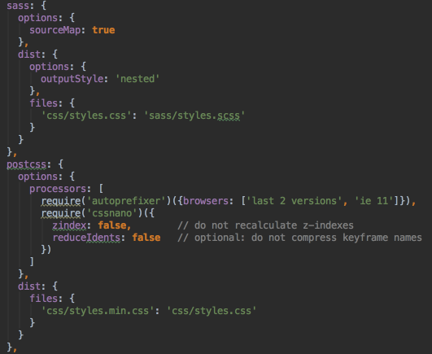
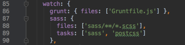

# Drupal 8 theming with Twig and Sass

{{ TOC }}

**Presentation Date, Location**

[Drupal Developer Days Milan](http://milan2016.drupaldays.org), Italy, June 21-26 2016

**Abstract**
In this session we will make a quick start into templating. We will see how to setup Grunt.js to automate CSS, JS and asset creation. This will bring us to an easy maintainable drupal theme. The main topics:

- add a set of favicons
- configuring Grunt tasks
- setup a Sass and JS workflow
- use SVG as background images
- some extras from lessons learned

This talk contains the experience of several Drupal 8 projects already in production.

## About the Speaker

**Tassilo Groeper**
- Full stack developer at [WONDROUS LLC](www.wearewondrous.com) Basel/Switzerland
- first Drupal 8 pages published with beta-4
- Clean Coder, originally from Germany

## What to expect

- Quick jump into a theme setup
- add a set of favicons
- setup Sass workflow
- BrowserSync as auto reload and browser sync feature
- SVG backgrounds with grunticon
- JS aggregation (e.g. owl-carousel)
- Extras:
	- enhance content manager experience
	- Detail/overview page navigation
	- SEO Bug in Drupal 8

## The Repo

- find at: Github

## Favicon

- [realfavicongenerator.net](http://realfavicongenerator.net)
- put the downloads into `favicons`-folder

## Node JS, Grunt and SASS setup

- `Grundfile.js` and `package.json`
- `$ npm install`
- `grunt` default task
- two step SASS to CSS compression and post processing
- BrowserSync as auto reload and browser sync feature
- SVG backgrounds [grunticon](https://github.com/filamentgroup/grunticon)
- JS aggregation (e.g. owl-carousel)
- Tip:
	- put `.htaccess` in privat folders like `sass`, `js-src` and `grunt-templates`

### Step One: Sass compile

- create Sass task, PostCSS Task and watch files
- use BrowserSync while watching
- create nested file `styles.css` and post processed file `styles.min.css`
- differentiate between the CSS processing steps, may be error prone, e.g.:
	- z-index, calculation
	- animation keywords

	Take home Message:

	** Pure CSS is like PHP with magic numbers and no functions at all**

### Step Two: Add SVG Background

- create folder `svg-src/backgrounds`
- add tasks `svgmin`, `clean`, `grunticon`
- see `grunt-templates/grunticon/backgrounds.hbs` for Sass template

### Step Three: Style the Article Teaser

- create `templates/content/node--article--teaser.html.twig`
- shape it to be one single anchor and style it

### Step Four: Make the Article view a Slider

- [Owl Carousel 2](https://github.com/OwlCarousel2/OwlCarousel2)
- add JS vendor Owl.Carousel and SASS Files (use bower or zip-download)
- update `Gruntfile.js` to `uglify` JS
- see JS glitch, before JS has fully loaded
	- create `custom-owl-carousel.scss`

Take home Message:

**Style as if there was no JS (yet fully loaded)!**

## Extra One: Article detail Page Styling

- https://www.drupal.org/node/2228783
- add `p.teaser` and `a.button` styles
- but hard to set for content manager (even with editor styles)
- so add to `thematic.info.yml`

		ckeditor_stylesheets:
		  - css/ckeditor-iframe.css

## Extra Two: Article Back button

- how to come back to views overview page (currently homepage)?
- use `{{ path('view.searchresults.page_1') }}` (relative path) in anchor
- add `node--article.html.twig` and add anchor on bottom

### TWIG Routes

- get [Drupal Console](https://github.com/hechoendrupal/DrupalConsole)
- `$ drupal router:debug` to find paths
- `{{ path('view.searchresults.page_1') }}` // relative path
- `{{ path('entity.node.canonical', {'node': node.id}) }}` // with params
- `{{ url('view.searchresults.page_1') }}` // absolute path
- https://chromatichq.com/blog/creating-links-within-twig-templates-using-path-and-url

## Extra Three: SEO malus by header links

- SEO problem until www.drupal.org/node/2406533
- plus a lot of permission denied (image) in the logs
- interim help: https://github.com/enjoyiacm/unset_html_head_link

